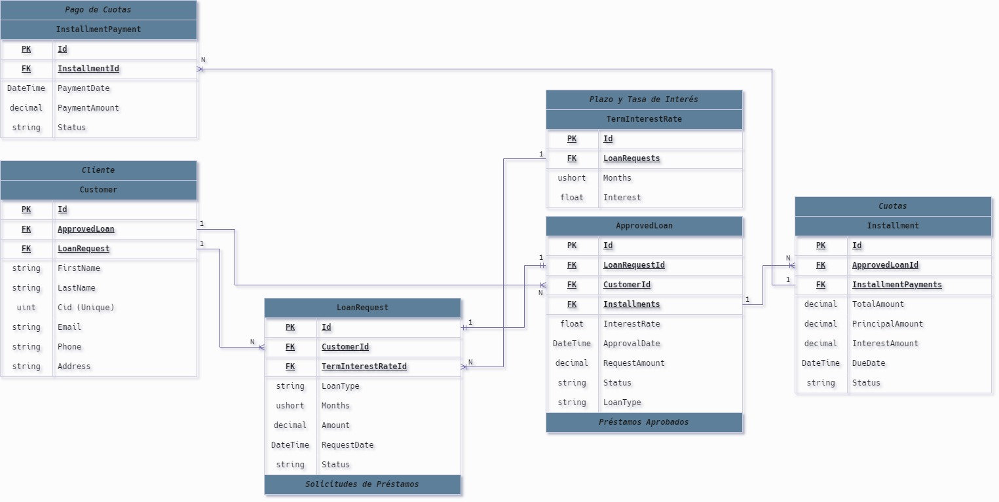
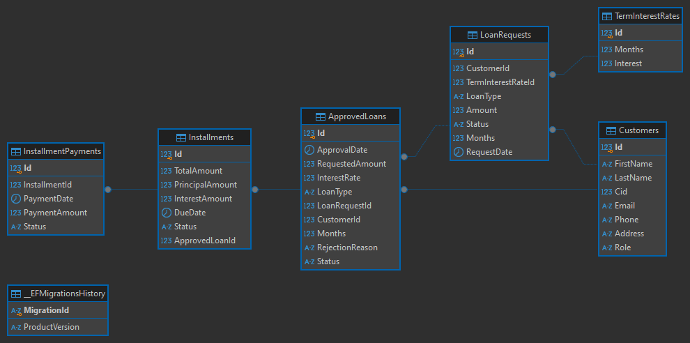

# BankManagement


## Ejecución del proyecto
### 1. Clonar el repositorio
```sh
git clone https://github.com/MauricioCLT/BankManagement.git && cd BankManagement
```

### 2. Crear un nuevo volumen de docker
`CMD`
```sh
docker container run ^
-dp 5432:5432 ^
--name postgres-bootcamp-prueba ^
-e POSTGRES_PASSWORD=123456 ^
-v postgres-bootcamp-prueba:/var/lib/postgresql/data ^
postgres:15.1
```

`POWERSHELL`
```ps1
docker container run \
-dp 5432:5432 \
--name postgres-bootcamp-prueba \
-e POSTGRES_PASSWORD=123456 \
-v postgres-bootcamp-prueba:/var/lib/postgresql/data \
postgres:15.1
```

### 3. Verificar en el connection string que todo este correcto.
```json
"ConnectionStrings": {
  "BankManagement": "Host=localhost; Database=bank; Username=postgres; Password=123456"
},
```

### 4. Aplicar las migraciones a la base de datos
```ps1
dotnet ef database update -p Infrastructure -s BankManagement
```

### 5. Datos para la prueba
`Customers`
```sql
insert into customers (id, name, email, phone, address, city, state, zipcode, country, credit_limit) 
values (1, 'Camey Aland', 'camery@aland.com', '555-555-5555', '123 Main Street', 'New York', 'NY', '10001', 'USA', 10000);
```

`TermInterestRates`
```sql
insert into term_interest_rates (rate, months)
values (9.15, 6)
values (12.5, 12)
values (15.0, 24)
values (18.0, 36)
values (21.0, 48);
```

### 5. Ejecución del proyecto
#### 5.1 Modo Debug
```ps1
cd BankManagement && dotnet run
```
#### 5.2 Modo Release
```ps1
cd BankManagement && dotnet -c Release && dotnet run
```

# Requerimientos del Sistema
## 1. `Creación de la Entidad "Plazo y Tasa de Interés`


## 2. `Simulador de Cuota`

`POST` `/api/SimulateLoan/Simulate-Credit`

```json
{
  "amount": 100000,
  "months": 6
}
```

`Simulate Credit Response`
```json
{
  "interestRate": 9.15,
  "monthyPayment": 17114.309416309,
  "totalPayment": 102685.856497854
}
```

---

## 3. `Solicitud de Préstamo`

`POST` `/api/Bank/Request-Loan`
```json
{
  "customerId": 1,
  "loanType": "Hipotecario",
  "months": 6,
  "amountRequest": 1000000
}
```

`Request Loan Response`

```json
{
  "customerId": 1,
  "loanRequestId": 12,
  "loanType": "Hipotecario",
  "months": 6,
  "amount": 1000000,
  "requestDate": "2024-11-25",
  "status": "Pending"
}
```

## `4. Aprobación/Rechazo de Solicitudes`

`POST` `/api/Bank/Approve-Loan`
```json
{

}
```

`Response`
```json
{

}
```
`POST` `/api/Bank/Reject-Loan`
```json
{

}
```

`Response`
```json
{

}
```


## `5. Consulta de Detalles de un Préstamo`

`GET` `/api/Bank/{loanRequestId}/Details`

`Response`
```json
{
  "customerId": 1,
  "customerName": "Camey Aland",
  "approvedDate": "2024-11-25T15:52:25.656532Z",
  "requestedAmount": 10360000,
  "totalAmount": 11307940,
  "revenue": 947940,
  "months": 6,
  "loanType": "Hipotecario",
  "interestRate": 9.15,
  "completePayments": 0,
  "uncompletePayments": 0,
  "nextDueDate": null,
  "paymentStatus": "All payments completed"
}
```

## `6. Pago de Cuotas`
`POST` `api/Bank/{loanRequestId}/Pay-Installment`
```json
{
  "loanRequestId": 0,
  "installmentIds": [
    0
  ]
}
```

`Response`
```json
{

}
```

## `7. Listado de Cuotas`
Enpoint para listar las cuotas de un préstamo. Permitir filtrar por:
- Todas las cuotas.
- Cuotas pagadas.
- Cuotas pendientes por pagar.

`Response`
```json
{

}
```

## `8. Listado de Cuotas Atrasadas`
Listar todas las cuotas atrasadas, mostrando:
- Cliente asociado.
- Fecha de vencimiento de la cuota.
- Días de atraso.
- Monto pendiente.

`Response`
```json
{

}
```

---

# Entidades de la Base de Datos



## Diagrama Entidad Relación
