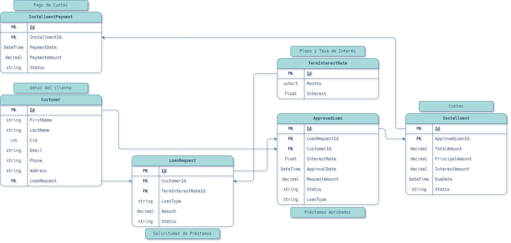
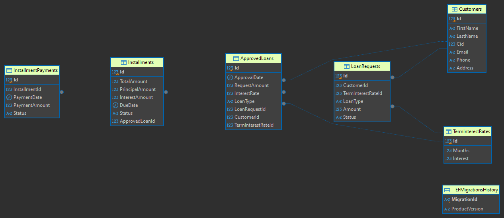

# BankManagement

---



## Diagrama Entidad Relación


---

## Requerimientos del Sistema
- [x] 
# 1. `Creación de la Entidad "Plazo y Tasa de Interés`


- [x] 
# 2. `Simulador de Cuota`

`POST` `/api/SimulateLoan/Simulate-Credit`

```json
{
  "amount": 100000,
  "months": 6
}
```

`Simulate Credit Response`
```json
{
  "interestRate": 9.15,
  "monthyPayment": 17114.309416309,
  "totalPayment": 102685.856497854
}
```

---

- [x] 
# 3. `Solicitud de Préstamo`

`POST` `/api/Bank/Request-Loan`
```json
{
  "customerId": 1,
  "loanType": "Personal",
  "months": 6,
  "amountRequest": 150000,
}
```

`Request Loan Response`

```json
{
  "loanType": "Personal",
  "months": 6,
  "amountRequest": 150000,
}
```


- Crear una funcionalidad que permita a los clientes registrar solicitudes de préstamo, donde puedan seleccionar:
  1. Tipo de Préstamo: Personal, hipotecario, automotriz, etc.
  2. Plazo: En meses.
  3. Monto: Cantidad solicitada.

- Requisitos Técnicos:
  1. Validar que el plazo ingresado sea un valor existente.
  2. Almacenar la solicitud en una tabla en la base de datos.
  3. Definir un estado inicial para la solicitud, como "Pendiente de Aprobación".

<span style="color: red">TODO:</span>
Fix this part add new colum into `LoanRequests`
```cs
public async Task<RequestLoanResponse> CreateRequestLoan(RequestLoan requestLoan)
{
    var termInterstRate = await _context.TermInterestRates.FirstOrDefaultAsync(x => x.Months == requestLoan.Months);

    if (termInterstRate == null)
        throw new Exception("El plazo ingresado no es valido!");

    var loanRequest = new LoanRequest
    {
        CustomerId = requestLoan.CustomerId,
        LoanType = requestLoan.LoanType,
        // Months = requestLoan.Months,
        Amount = requestLoan.AmountRequest,
        Status = "Pending",
        TermInterestRateId = termInterstRate.Id
    };

    // var loanRequestAdap = requestLoan.Adapt<LoanRequest>();

    _context.LoanRequests.Add(loanRequest);
    await _context.SaveChangesAsync();

    var requestLoanResponse = new RequestLoanResponse
    {
        CustomerId = loanRequest.CustomerId,
        LoanType = loanRequest.LoanType,
        Amount = loanRequest.Amount,
        // Months = loanRequest,
        Status = requestLoan.Status
    };

    return requestLoanResponse;

```